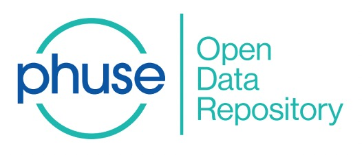

#PHUSE Open Data Repository ("PODR")

##Description

One challenge when using Open Data is that the raw data distributed by sources comes in multiple formats (CSV, Excel, XML) and sometimes a single dataset has used different file layouts over the years.

A second challenge with using Open Data is the need for users to integrate all those disparate datasets from multiple sources into an easy-to-search system.

PODR integrates health-related Open Data across agencies, within departments of each relevant agency, and across countries. PODR gives users a single interface to search across all available datasets.

NIHPO and PhUSE intend PODR to:
* Increase PhUSE member engagement with PhUSE’s Working Groups and events.
* Eliminate user’s time-consuming “Data Prep” process of loading and massaging raw data. “From Zero to Analysis” in under five minutes.
* Accelerate discovery of solutions to data-centric challenges posed by PhUSE sponsors, members.
* Make it easier for PhUSE members to learn new tools and technologies (Jupyter, Python, R).
* Give each PhUSE member the opportunity to quickly launch new projects and collaborative research projects with other members.
* Make data analytics accessible to all levels of users, from Excel users to power users.
Where PhUSE members will not need any IT involvement to use PODR.

#Table of Contents
[Documentation](/documentation)
[Sample Code](/sample_code)
[Use Cases](/use_cases)

Usage: The next section is usage, in which you instruct other people on how to use your project after they’ve installed it. This would also be a good place to include screenshots of your project in action.

#Contributing
Any and all contributions 

#Credits
PODR is an instance of the NIHPO Platform [NIHPO](http://nihpo.com).
The NIHPO Platform integrates health-related Open Data across agencies, within departments of each relevant agency, and across countries. The NIHPO Platform gives users a single interface to search across all available datasets.

#License
All Intellectual Property Rights, including copyright and trade secrets (“IPRs”), related to both PODR and the underlying NIHPO Platform belong solely to NIHPO. Including, but not limited to:
* NIHPO’s software
* Data processing and deployment processes and tools
* NIHPO’s Enriched Open Data
* Manuals and documentation
* Webinars and any training sessions delivered by NIHPO staffers