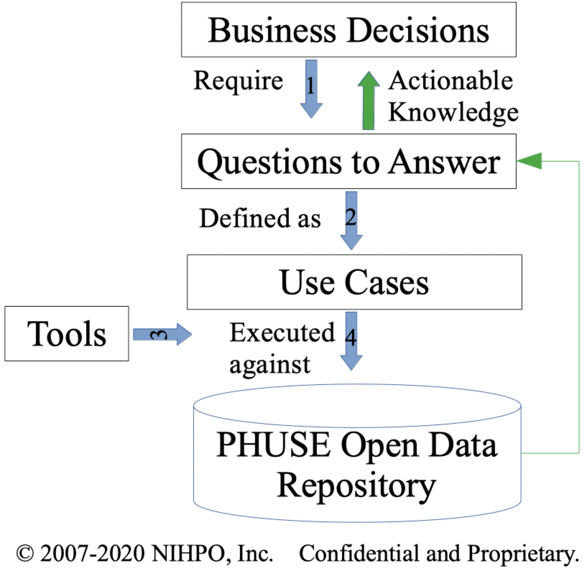

# PHUSE - Process of Analysis

We're 

* Identify the critical [Business Decisions] that have
* [Questions to Answer], to be defined as
* [Use Cases] of Who needs to Do What using
* [Tools] executed against
* [Data] in the PHUSE Open Data Repository

